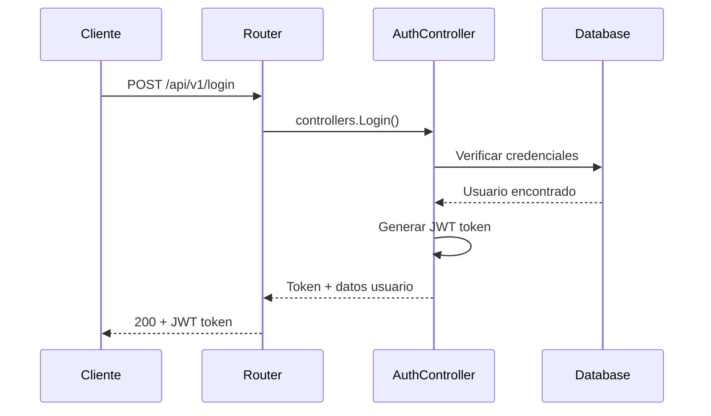
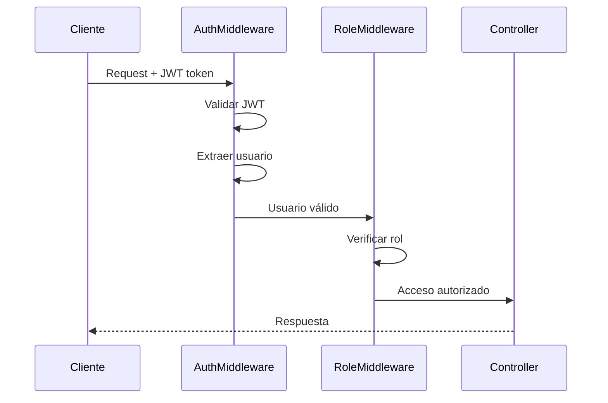
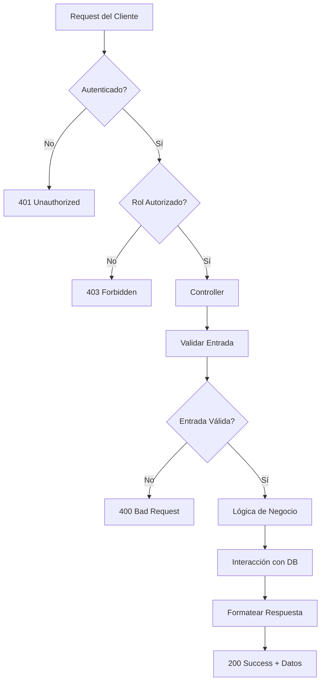

# 🏗️ Arquitectura y Flujo del Sistema

## 📐 Arquitectura General

El proyecto sigue una arquitectura **REST API** con patrón **MVC** modificado para APIs, organizando el código en capas bien definidas.

```
┌─────────────────┐    ┌─────────────────┐    ┌─────────────────┐
│    Frontend     │    │   API Gateway   │    │    Database     │
│   (Separado)    │◄──►│  (Puerto 8085)  │◄──►│   PostgreSQL    │
└─────────────────┘    └─────────────────┘    └─────────────────┘
                               │
                    ┌─────────────────┐
                    │  Backend API    │
                    │   (Go + Gin)    │
                    └─────────────────┘
```

### 🏛️ Capas de la Arquitectura

#### 1. **Capa de Entrada** (Entry Layer)
**Archivo principal:** `main.go`
- Inicialización de la aplicación
- Configuración de variables de entorno
- Conexión a base de datos
- Configuración de CORS
- Inicio del servidor Gin

```go
// main.go:13-17 - Carga de configuración
if err := godotenv.Load(); err != nil {
    log.Println("No .env file found")
}
config.ConnectDatabase()
```

#### 2. **Capa de Ruteo** (Routing Layer)
**Archivo:** `routes/routes.go`
- Definición de endpoints
- Agrupación de rutas por funcionalidad
- Aplicación de middleware

```go
// routes/routes.go:9-15 - Estructura de rutas
api := r.Group("/api/v1")
// Public routes
api.POST("/register", controllers.Register)
api.POST("/login", controllers.Login)
api.GET("/resistance", controllers.GetResistancePage)
```

#### 3. **Capa de Middleware** (Middleware Layer)
**Archivos:** `middleware/auth.go`, `middleware/rbac.go`
- Autenticación JWT
- Autorización basada en roles
- Validación de tokens
- Control de acceso

#### 4. **Capa de Controladores** (Controller Layer)
**Archivos:** `controllers/*.go`
- Lógica de negocio
- Validación de entrada
- Procesamiento de requests
- Formateo de respuestas

#### 5. **Capa de Modelos** (Model Layer)
**Archivos:** `models/*.go`
- Definición de estructuras de datos
- Validaciones de modelo
- Relaciones entre entidades

#### 6. **Capa de Configuración** (Config Layer)
**Archivos:** `config/database.go`
- Configuración de base de datos
- Migración automática
- Conexión con GORM

## 🔄 Flujo de Datos Detallado

### 🔐 Flujo de Autenticación



**Implementación en código:**
```go
// controllers/auth.go:38-67 - Proceso de login
func Login(c *gin.Context) {
    // 1. Validar entrada
    var input models.UserLogin
    if err := c.ShouldBindJSON(&input); err != nil {
        c.JSON(http.StatusBadRequest, gin.H{"error": err.Error()})
        return
    }
    
    // 2. Buscar usuario
    var user models.User
    if err := config.DB.Where("email = ?", input.Email).First(&user).Error; err != nil {
        c.JSON(http.StatusUnauthorized, gin.H{"error": "Invalid credentials"})
        return
    }
    
    // 3. Verificar contraseña
    if err := bcrypt.CompareHashAndPassword([]byte(user.Password), []byte(input.Password)); err != nil {
        c.JSON(http.StatusUnauthorized, gin.H{"error": "Invalid credentials"})
        return
    }
    
    // 4. Generar JWT
    token := jwt.NewWithClaims(jwt.SigningMethodHS256, jwt.MapClaims{
        "user_id": user.ID,
        "email":   user.Email,
        "role":    user.Role,
        "exp":     time.Now().Add(time.Hour * 24).Unix(),
    })
}
```

### 🛡️ Flujo de Autorización



**Implementación en código:**
```go
// middleware/auth.go:15-29 - Validación de token
authHeader := c.GetHeader("Authorization")
if authHeader == "" {
    c.JSON(http.StatusUnauthorized, gin.H{"error": "Authorization header required"})
    c.Abort()
    return
}

bearerToken := strings.Split(authHeader, " ")
if len(bearerToken) != 2 || strings.ToLower(bearerToken[0]) != "bearer" {
    c.JSON(http.StatusUnauthorized, gin.H{"error": "Invalid authorization format"})
    c.Abort()
    return
}
```

### 📊 Flujo de Datos de Negocio



## 🗄️ Arquitectura de Base de Datos

### Diseño de Relaciones

```
Users (1) ────────── (N) Posts
  │                     │
  │                     └── author_id (FK)
  │
  ├── (1) ────────── (N) Reports (as demon)
  │                     │
  │                     └── demon_id (FK)
  │
  ├── (1) ────────── (N) Reports (as victim)
  │                     │
  │                     └── victim_id (FK)
  │
  └── (1) ────────── (N) Rewards
                        │
                        └── demon_id (FK)
```

**Implementación en modelos:**
```go
// models/user.go:18-27 - Relaciones del usuario
type User struct {
    ID        uint           `json:"id" gorm:"primaryKey"`
    // ... otros campos
    Posts     []Post     `json:"posts,omitempty" gorm:"foreignKey:AuthorID"`
    Reports   []Report   `json:"reports,omitempty" gorm:"foreignKey:DemonID"`
    Rewards   []Reward   `json:"rewards,omitempty" gorm:"foreignKey:DemonID"`
}
```

### Migración Automática

**Archivo:** `config/database.go:25-31`
```go
err = database.AutoMigrate(
    &models.User{},
    &models.Post{},
    &models.Report{},
    &models.Reward{},
)
```

## 🚀 Flujo de Inicialización

### Secuencia de Arranque

1. **Carga de Variables de Entorno** (`main.go:15-17`)
   ```go
   if err := godotenv.Load(); err != nil {
       log.Println("No .env file found")
   }
   ```

2. **Conexión a Base de Datos** (`main.go:20`)
   ```go
   config.ConnectDatabase()
   ```

3. **Configuración del Router** (`main.go:23`)
   ```go
   r := gin.Default()
   ```

4. **Configuración de CORS** (`main.go:26-35`)
   ```go
   r.Use(func(c *gin.Context) {
       c.Header("Access-Control-Allow-Origin", "*")
       c.Header("Access-Control-Allow-Methods", "GET, POST, PUT, DELETE, OPTIONS")
       c.Header("Access-Control-Allow-Headers", "Content-Type, Authorization")
       // ...
   })
   ```

5. **Configuración de Rutas** (`main.go:38`)
   ```go
   routes.SetupRoutes(r)
   ```

6. **Inicio del Servidor** (`main.go:41-48`)
   ```go
   port := os.Getenv("PORT")
   if port == "" {
       port = "8080"
   }
   log.Printf("Server starting on port %s", port)
   if err := r.Run(":" + port); err != nil {
       log.Fatal("Failed to start server:", err)
   }
   ```

## 🔧 Configuración de Middleware

### Cadena de Middleware

```
Request → CORS → Auth Required → Role Check → Controller → Response
```

**Implementación en rutas:**
```go
// routes/routes.go:14-16 - Middleware en cadena
auth := api.Group("/")
auth.Use(middleware.AuthRequired())

// routes/routes.go:19-20 - Middleware específico de rol
andrei := auth.Group("/admin")
andrei.Use(middleware.RequireAndrei())
```

## 📡 Patrones de Respuesta

### Estructura Estándar de Respuestas

**Éxito (200-201):**
```json
{
  "data": { ... },
  "message": "Success message"
}
```

**Error (400-500):**
```json
{
  "error": "Error description"
}
```

**Implementación típica:**
```go
// Patrón de respuesta exitosa
c.JSON(http.StatusOK, gin.H{"users": users})

// Patrón de respuesta de error
c.JSON(http.StatusBadRequest, gin.H{"error": err.Error()})
```

## 🔄 Ciclo de Vida de Request

1. **Recepción**: Gin recibe HTTP request
2. **Routing**: Router determina el handler
3. **Middleware**: Cadena de middleware se ejecuta
4. **Controller**: Lógica de negocio se procesa
5. **Model**: Interacción con base de datos
6. **Response**: Formateo y envío de respuesta

---
*Esta arquitectura permite escalabilidad, mantenibilidad y separación clara de responsabilidades en el sistema.*