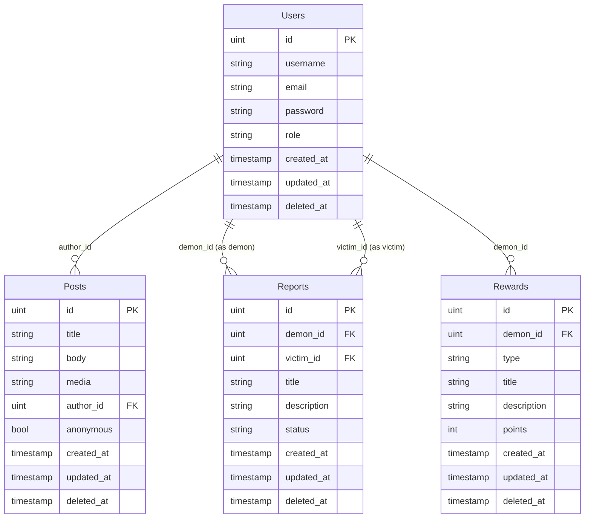

# 🗄️ Diseño de Base de Datos

## 📊 Diagrama de Entidades y Relaciones



## 📋 Definición de Entidades

### 👤 Users (Usuarios)
**Archivo:** `models/user.go:14-27`

```go
type User struct {
    ID        uint           `json:"id" gorm:"primaryKey"`
    Username  string         `json:"username" gorm:"unique;not null"`
    Email     string         `json:"email" gorm:"unique;not null"`
    Password  string         `json:"-" gorm:"not null"`
    Role      UserRole       `json:"role" gorm:"not null"`
    CreatedAt time.Time      `json:"created_at"`
    UpdatedAt time.Time      `json:"updated_at"`
    DeletedAt gorm.DeletedAt `json:"-" gorm:"index"`
    
    // Relaciones
    Posts     []Post     `json:"posts,omitempty" gorm:"foreignKey:AuthorID"`
    Reports   []Report   `json:"reports,omitempty" gorm:"foreignKey:DemonID"`
    Rewards   []Reward   `json:"rewards,omitempty" gorm:"foreignKey:DemonID"`
}
```

**Roles Disponibles** (`models/user.go:8-12`):
```go
type UserRole string
const (
    RoleAndrei      UserRole = "andrei"
    RoleDemon       UserRole = "demon"
    RoleNetworkAdmin UserRole = "network_admin"
)
```

**Características:**
- **Primary Key**: `id` (auto-increment)
- **Unique Constraints**: `username`, `email`
- **Soft Delete**: Usando `deleted_at` con GORM
- **JSON Exclusion**: `password` excluido de respuestas JSON
- **Validaciones**: `not null` en campos críticos

### 📝 Posts (Publicaciones)
**Archivo:** `models/post.go:8-19`

```go
type Post struct {
    ID        uint           `json:"id" gorm:"primaryKey"`
    Title     string         `json:"title" gorm:"not null"`
    Body      string         `json:"body" gorm:"not null"`
    Media     string         `json:"media,omitempty"`
    AuthorID  *uint          `json:"author_id,omitempty"`
    Author    *User          `json:"author,omitempty" gorm:"foreignKey:AuthorID"`
    Anonymous bool           `json:"anonymous" gorm:"default:false"`
    CreatedAt time.Time      `json:"created_at"`
    UpdatedAt time.Time      `json:"updated_at"`
    DeletedAt gorm.DeletedAt `json:"-" gorm:"index"`
}
```

**Características Especiales:**
- **Autor Opcional**: `AuthorID` puede ser `null` para posts anónimos
- **Flag de Anonimato**: `Anonymous` para identificar posts sin autor
- **Preload Relationship**: Author se puede cargar con `Preload("Author")`
- **Media Opcional**: Campo para URLs de imágenes/videos

### 📊 Reports (Reportes)
**Archivo:** `models/report.go:8-22`

```go
type Report struct {
    ID          uint           `json:"id" gorm:"primaryKey"`
    DemonID     uint           `json:"demon_id" gorm:"not null"`
    Demon       User           `json:"demon" gorm:"foreignKey:DemonID"`
    VictimID    uint           `json:"victim_id" gorm:"not null"`
    Victim      User           `json:"victim" gorm:"foreignKey:VictimID"`
    Title       string         `json:"title" gorm:"not null"`
    Description string         `json:"description" gorm:"not null"`
    Status      string         `json:"status" gorm:"default:'pending'"`
    CreatedAt   time.Time      `json:"created_at"`
    UpdatedAt   time.Time      `json:"updated_at"`
    DeletedAt   gorm.DeletedAt `json:"-" gorm:"index"`
}
```

**Relaciones Duales:**
- **DemonID → User**: Relación con usuario demonio
- **VictimID → User**: Relación con usuario víctima
- **Estados**: `pending`, `in_progress`, `completed`

### 🏆 Rewards (Recompensas/Castigos)
**Archivo:** `models/reward.go:8-25`

```go
type Reward struct {
    ID          uint           `json:"id" gorm:"primaryKey"`
    DemonID     uint           `json:"demon_id" gorm:"not null"`
    Demon       User           `json:"demon" gorm:"foreignKey:DemonID"`
    Type        RewardType     `json:"type" gorm:"not null"`
    Title       string         `json:"title" gorm:"not null"`
    Description string         `json:"description" gorm:"not null"`
    Points      int            `json:"points" gorm:"default:0"`
    CreatedAt   time.Time      `json:"created_at"`
    UpdatedAt   time.Time      `json:"updated_at"`
    DeletedAt   gorm.DeletedAt `json:"-" gorm:"index"`
}
```

**Tipos de Recompensa** (`models/reward.go:13-17`):
```go
type RewardType string
const (
    RewardTypeReward     RewardType = "reward"
    RewardTypePunishment RewardType = "punishment"
)
```

## 🔗 Relaciones Entre Entidades

### Relación User ↔ Posts
```go
// Un usuario puede tener muchos posts
Posts []Post `gorm:"foreignKey:AuthorID"`

// Un post pertenece a un usuario (opcional para anónimos)
AuthorID *uint `json:"author_id,omitempty"`
Author   *User `gorm:"foreignKey:AuthorID"`
```

### Relación User ↔ Reports (Dual)
```go
// Como Demonio: Un usuario puede crear muchos reportes
Reports []Report `gorm:"foreignKey:DemonID"`

// Como Víctima: Un usuario puede ser sujeto de muchos reportes
// (Implícita a través de VictimID)
```

### Relación User ↔ Rewards
```go
// Un demonio puede recibir muchas recompensas/castigos
Rewards []Reward `gorm:"foreignKey:DemonID"`
```

## 📈 Modelos de Estadísticas

### DemonStats (Estadísticas de Demonio)
**Archivo:** `models/statistics.go:3-10`

```go
type DemonStats struct {
    DemonID        uint  `json:"demon_id"`
    VictimsCount   int64 `json:"victims_count"`
    RewardsCount   int64 `json:"rewards_count"`
    PunishmentsCount int64  `json:"punishments_count"`
    TotalPoints    int64  `json:"total_points"`
    ReportsCount   int64  `json:"reports_count"`
}
```

### PlatformStats (Estadísticas de Plataforma)
**Archivo:** `models/statistics.go:12-18`

```go
type PlatformStats struct {
    TotalUsers       int64 `json:"total_users"`
    TotalDemons      int64 `json:"total_demons"`
    TotalNetworkAdmins int64 `json:"total_network_admins"`
    TotalPosts       int64 `json:"total_posts"`
    TotalReports     int64 `json:"total_reports"`
}
```

## 🛠️ Configuración de Base de Datos

### Conexión y Migración
**Archivo:** `config/database.go:11-35`

```go
func ConnectDatabase() {
    dbHost := os.Getenv("DB_HOST")
    dbPort := os.Getenv("DB_PORT")
    dbUser := os.Getenv("DB_USER")
    dbPassword := os.Getenv("DB_PASSWORD")
    dbName := os.Getenv("DB_NAME")

    dsn := fmt.Sprintf("host=%s port=%s user=%s password=%s dbname=%s sslmode=disable",
        dbHost, dbPort, dbUser, dbPassword, dbName)

    database, err := gorm.Open(postgres.Open(dsn), &gorm.Config{})
    if err != nil {
        log.Fatal("Failed to connect to database:", err)
    }

    // Migración automática
    err = database.AutoMigrate(
        &models.User{},
        &models.Post{},
        &models.Report{},
        &models.Reward{},
    )
    if err != nil {
        log.Fatal("Failed to migrate database:", err)
    }

    DB = database
    log.Println("Database connected and migrated successfully")
}
```

## 📊 Consultas Complejas

### Estadísticas de Demonio
**Archivo:** `controllers/demon.go:93-100`

```go
func GetMyStats(c *gin.Context) {
    user := c.MustGet("user").(models.User)
    var stats models.DemonStats
    stats.DemonID = user.ID

    // Contar víctimas únicas
    config.DB.Model(&models.User{}).Where(
        "role = ? AND id IN (SELECT victim_id FROM reports WHERE demon_id = ?)", 
        models.RoleNetworkAdmin, user.ID).Count(&stats.VictimsCount)
    
    // Contar recompensas y castigos
    config.DB.Model(&models.Reward{}).Where(
        "demon_id = ? AND type = ?", user.ID, models.RewardTypeReward).Count(&stats.RewardsCount)
    config.DB.Model(&models.Reward{}).Where(
        "demon_id = ? AND type = ?", user.ID, models.RewardTypePunishment).Count(&stats.PunishmentsCount)
    
    // Sumar puntos totales
    config.DB.Model(&models.Reward{}).Where(
        "demon_id = ?", user.ID).Select("COALESCE(SUM(points), 0)").Scan(&stats.TotalPoints)
}
```

### Ranking de Demonios
**Archivo:** `controllers/andrei.go:95-123`

```go
func GetDemonRanking(c *gin.Context) {
    var demons []models.User
    config.DB.Where("role = ?", models.RoleDemon).Find(&demons)

    var demonStats []models.DemonStats
    for _, demon := range demons {
        var stats models.DemonStats
        stats.DemonID = demon.ID

        // Múltiples queries para calcular estadísticas
        config.DB.Model(&models.User{}).Where(
            "role = ? AND id IN (SELECT victim_id FROM reports WHERE demon_id = ?)", 
            models.RoleNetworkAdmin, demon.ID).Count(&stats.VictimsCount)
        
        // ... más queries de estadísticas
        demonStats = append(demonStats, stats)
    }
    
    c.JSON(http.StatusOK, gin.H{"demon_rankings": demonStats})
}
```

## 🔍 Índices y Optimizaciones

### Índices Automáticos (GORM)
```go
// Índice para soft delete
DeletedAt gorm.DeletedAt `gorm:"index"`

// Índices únicos
Username string `gorm:"unique;not null"`
Email    string `gorm:"unique;not null"`
```

### Optimizaciones Implementadas
1. **Soft Delete**: Permite recuperación de datos
2. **Foreign Keys**: Integridad referencial automática
3. **Preloading**: Carga eficiente de relaciones
4. **Índices**: En campos de búsqueda frecuente

## 🧪 Datos de Prueba

### Script de Población
**Archivo:** `cmd/populate/main.go`

El script crea datos realistas:
- 5 demonios con credenciales `demon123`
- 8 administradores de red con credenciales `admin123`
- 10 reportes entre demonios y víctimas
- 10 recompensas/castigos con puntos variados
- 12 posts de diferentes tipos y autores

---
*Este diseño de base de datos soporta todas las funcionalidades del sistema de roles y proporciona flexibilidad para futuras extensiones.*