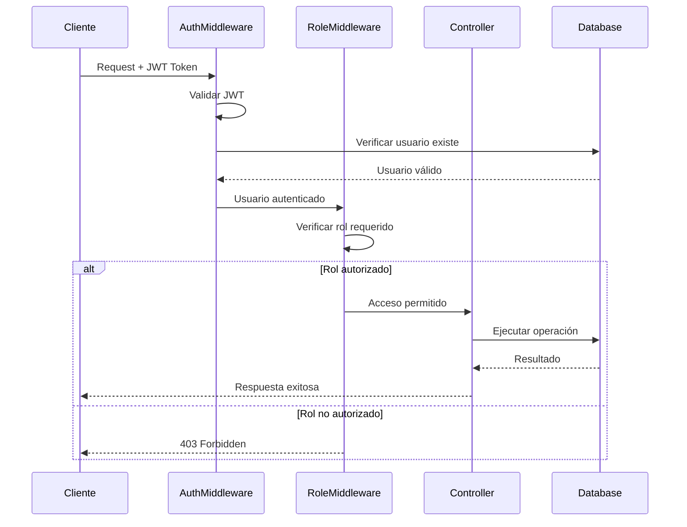

# 🛡️ Control de Acceso Basado en Roles (RBAC)

## 📋 Visión General

El sistema implementa un **Role-Based Access Control (RBAC)** que define tres roles distintos con permisos específicos. Cada usuario tiene asignado exactamente un rol que determina qué endpoints puede acceder y qué acciones puede realizar.

## 👥 Definición de Roles

### Jerarquía de Roles
```
👑 Andrei (Suprema Líder)
├── Control total del sistema
├── CRUD sobre todas las entidades
└── Administración de usuarios y contenido

👹 Demon (Ejecutor)
├── Gestión de víctimas
├── Creación de reportes
└── Estadísticas personales

👨‍💻 Network Admin (Víctima)
├── Acceso limitado
└── Participación en resistencia
```

### Roles en el Código
**Archivo:** `models/user.go:8-12`

```go
type UserRole string

const (
    RoleAndrei      UserRole = "andrei"        // Rol supremo
    RoleDemon       UserRole = "demon"         // Rol ejecutor
    RoleNetworkAdmin UserRole = "network_admin" // Rol víctima
)
```

## 🔐 Implementación de Middleware RBAC

### Middleware Base de Roles
**Archivo:** `middleware/rbac.go:9-25`

```go
func RequireRole(allowedRoles ...models.UserRole) gin.HandlerFunc {
    return gin.HandlerFunc(func(c *gin.Context) {
        // 1. Obtener usuario del contexto (ya autenticado)
        user, exists := c.Get("user")
        if !exists {
            c.JSON(http.StatusUnauthorized, gin.H{"error": "User not found in context"})
            c.Abort()
            return
        }

        currentUser := user.(models.User)
        
        // 2. Verificar si el rol del usuario está permitido
        for _, role := range allowedRoles {
            if currentUser.Role == role {
                c.Next() // Rol autorizado, continuar
                return
            }
        }

        // 3. Rol no autorizado
        c.JSON(http.StatusForbidden, gin.H{"error": "Insufficient permissions"})
        c.Abort()
    })
}
```

### Middleware Específicos por Rol
**Archivo:** `middleware/rbac.go:27-41`

```go
// Solo Andrei puede acceder
func RequireAndrei() gin.HandlerFunc {
    return RequireRole(models.RoleAndrei)
}

// Solo Demonios pueden acceder
func RequireDemon() gin.HandlerFunc {
    return RequireRole(models.RoleDemon)
}

// Solo Network Admins pueden acceder
func RequireNetworkAdmin() gin.HandlerFunc {
    return RequireRole(models.RoleNetworkAdmin)
}

// Andrei o Demonios pueden acceder
func RequireAndreiOrDemon() gin.HandlerFunc {
    return RequireRole(models.RoleAndrei, models.RoleDemon)
}
```

## 🗺️ Mapeo de Rutas y Permisos

### Estructura de Rutas con RBAC
**Archivo:** `routes/routes.go:9-51`

```go
func SetupRoutes(r *gin.Engine) {
    api := r.Group("/api/v1")

    // 🌍 RUTAS PÚBLICAS (Sin autenticación)
    api.POST("/register", controllers.Register)
    api.POST("/login", controllers.Login)
    api.GET("/resistance", controllers.GetResistancePage)

    // 🔐 RUTAS PROTEGIDAS (Requieren autenticación)
    auth := api.Group("/")
    auth.Use(middleware.AuthRequired()) // ← Middleware de autenticación

    // 👑 RUTAS DE ANDREI (Solo rol 'andrei')
    andrei := auth.Group("/admin")
    andrei.Use(middleware.RequireAndrei()) // ← Middleware de rol específico
    {
        andrei.GET("/users", controllers.GetAllUsers)
        andrei.GET("/users/:id", controllers.GetUserByID)
        andrei.DELETE("/users/:id", controllers.DeleteUser)
        andrei.POST("/rewards", controllers.CreateReward)
        andrei.GET("/stats", controllers.GetPlatformStats)
        andrei.GET("/demons/ranking", controllers.GetDemonRanking)
        andrei.GET("/posts", controllers.GetAllPosts)
        andrei.DELETE("/posts/:id", controllers.DeletePost)
        andrei.POST("/posts", controllers.CreateAndreiPost)
    }

    // 👹 RUTAS DE DEMONIOS (Solo rol 'demon')
    demons := auth.Group("/demons")
    demons.Use(middleware.RequireDemon()) // ← Middleware de rol específico
    {
        demons.GET("/available-network-admins", controllers.GetAvailableNetworkAdmins)
        demons.POST("/victims", controllers.AssignVictim)
        demons.POST("/reports", controllers.CreateReport)
        demons.GET("/stats", controllers.GetMyStats)
        demons.GET("/victims", controllers.GetMyVictims)
        demons.GET("/reports", controllers.GetMyReports)
        demons.PUT("/reports/:id", controllers.UpdateReportStatus)
        demons.POST("/posts", controllers.CreateDemonPost)
    }

    // 👨‍💻 RUTAS DE NETWORK ADMINS (Solo rol 'network_admin')
    networkAdmins := auth.Group("/network-admins")
    networkAdmins.Use(middleware.RequireNetworkAdmin()) // ← Middleware de rol específico
    {
        networkAdmins.POST("/posts/anonymous", controllers.CreateAnonymousPost)
    }
}
```

## 📊 Matriz de Permisos

### Tabla de Acceso por Endpoint

| Endpoint | Público | Andrei | Demon | Network Admin |
|----------|---------|--------|-------|---------------|
| `POST /register` | ✅ | ✅ | ✅ | ✅ |
| `POST /login` | ✅ | ✅ | ✅ | ✅ |
| `GET /resistance` | ✅ | ✅ | ✅ | ✅ |
| `GET /admin/users` | ❌ | ✅ | ❌ | ❌ |
| `GET /admin/stats` | ❌ | ✅ | ❌ | ❌ |
| `POST /admin/rewards` | ❌ | ✅ | ❌ | ❌ |
| `DELETE /admin/users/:id` | ❌ | ✅ | ❌ | ❌ |
| `GET /demons/available-network-admins` | ❌ | ❌ | ✅ | ❌ |
| `POST /demons/victims` | ❌ | ❌ | ✅ | ❌ |
| `GET /demons/stats` | ❌ | ❌ | ✅ | ❌ |
| `POST /demons/reports` | ❌ | ❌ | ✅ | ❌ |
| `POST /network-admins/posts/anonymous` | ❌ | ❌ | ❌ | ✅ |

### Capacidades Específicas por Rol

#### 👑 **Andrei (Suprema Líder)**
```
✅ CRUD completo sobre usuarios
✅ CRUD completo sobre posts
✅ Asignación de recompensas/castigos
✅ Visualización de estadísticas globales
✅ Ranking de demonios
✅ Eliminación de cualquier contenido
✅ Creación de posts como autora identificada
```

#### 👹 **Demon (Ejecutor)**
```
✅ Visualización de Network Admins disponibles
✅ Asignación de víctimas existentes (no creación)
✅ Creación y gestión de reportes sobre víctimas propias
✅ Visualización de víctimas propias
✅ Estadísticas personales
✅ Creación de posts identificados
✅ Actualización de estado de reportes propios
❌ Acceso a datos de otros demonios
❌ Funciones administrativas
❌ Crear nuevos Network Admins
```

#### 👨‍💻 **Network Admin (Víctima)**
```
✅ Visualización de página de resistencia
✅ Creación de posts anónimos
❌ Acceso a datos de gestión
❌ Visualización de información de demonios
❌ Funciones administrativas
```

## 🔄 Flujo de Autorización

### Secuencia de Verificación de Permisos



### Implementación en Código

**1. Middleware de Autenticación** (`middleware/auth.go`)
```go
// Almacena el usuario en el contexto después de validar JWT
c.Set("user", user)
c.Next()
```

**2. Middleware de Rol** (`middleware/rbac.go`)
```go
// Obtiene usuario del contexto y verifica rol
user := c.MustGet("user").(models.User)
if currentUser.Role == requiredRole {
    c.Next() // Autorizado
} else {
    c.JSON(403, gin.H{"error": "Insufficient permissions"}) // No autorizado
}
```

**3. Controller** (ej. `controllers/andrei.go`)
```go
// Ya tiene garantía de que el usuario es Andrei
func GetAllUsers(c *gin.Context) {
    // Lógica específica de Andrei
}
```

## 🚨 Validaciones de Seguridad

### Validación en Registro
**Archivo:** `controllers/auth.go:19-23`

```go
// Solo demonios y network admins pueden registrarse
if input.Role != models.RoleDemon && input.Role != models.RoleNetworkAdmin {
    c.JSON(http.StatusBadRequest, gin.H{"error": "Invalid role. Only demon and network_admin roles can register"})
    return
}
```

### Validación de Propiedad de Recursos
**Archivo:** `controllers/demon.go:135-140`

```go
func UpdateReportStatus(c *gin.Context) {
    user := c.MustGet("user").(models.User)
    
    // Solo puede actualizar sus propios reportes
    var report models.Report
    if err := config.DB.Where("id = ? AND demon_id = ?", id, user.ID).First(&report).Error; err != nil {
        c.JSON(http.StatusNotFound, gin.H{"error": "Report not found"})
        return
    }
    // ...
}
```

### Validación de Asignación de Víctimas
**Archivo:** `controllers/demon.go:38-49`

```go
func AssignVictim(c *gin.Context) {
    // Verificar que la víctima existe y es network admin
    var victim models.User
    if err := config.DB.Where("id = ? AND role = ?", input.VictimID, models.RoleNetworkAdmin).First(&victim).Error; err != nil {
        c.JSON(http.StatusNotFound, gin.H{"error": "Network admin not found"})
        return
    }

    // Verificar que no sea ya víctima de este demonio
    var existingRelation models.DemonVictim
    if err := config.DB.Where("demon_id = ? AND victim_id = ?", user.ID, input.VictimID).First(&existingRelation).Error; err == nil {
        c.JSON(http.StatusConflict, gin.H{"error": "This network admin is already your victim"})
        return
    }
    // ...
}
```

## 📈 Casos de Uso de Autorización

### Caso 1: Demonio Intentando Acceder a Funciones de Andrei
```bash
# Request
GET /api/v1/admin/users
Authorization: Bearer [demon_token]

# Response
403 Forbidden
{
  "error": "Insufficient permissions"
}
```

### Caso 2: Network Admin Creando Contenido Anónimo
```bash
# Request
POST /api/v1/network-admins/posts/anonymous
Authorization: Bearer [admin_token]

# Response
201 Created
{
  "post": {
    "id": 123,
    "title": "Resistance Message",
    "anonymous": true,
    "author_id": null
  }
}
```

### Caso 3: Andrei con Acceso Total
```bash
# Request
DELETE /api/v1/admin/users/5
Authorization: Bearer [andrei_token]

# Response
200 OK
{
  "message": "User deleted successfully"
}
```

## 🔧 Extensibilidad del Sistema

### Agregar Nuevos Roles
1. **Definir rol en modelo:**
   ```go
   const RoleNewRole UserRole = "new_role"
   ```

2. **Crear middleware específico:**
   ```go
   func RequireNewRole() gin.HandlerFunc {
       return RequireRole(models.RoleNewRole)
   }
   ```

3. **Configurar rutas:**
   ```go
   newRoleGroup := auth.Group("/new-role")
   newRoleGroup.Use(middleware.RequireNewRole())
   ```

### Permisos Combinados
```go
// Múltiples roles pueden acceder
func RequireAdminOrDemon() gin.HandlerFunc {
    return RequireRole(models.RoleAndrei, models.RoleDemon)
}
```

---
*Este sistema RBAC proporciona control granular de acceso mientras mantiene simplicidad y escalabilidad.*